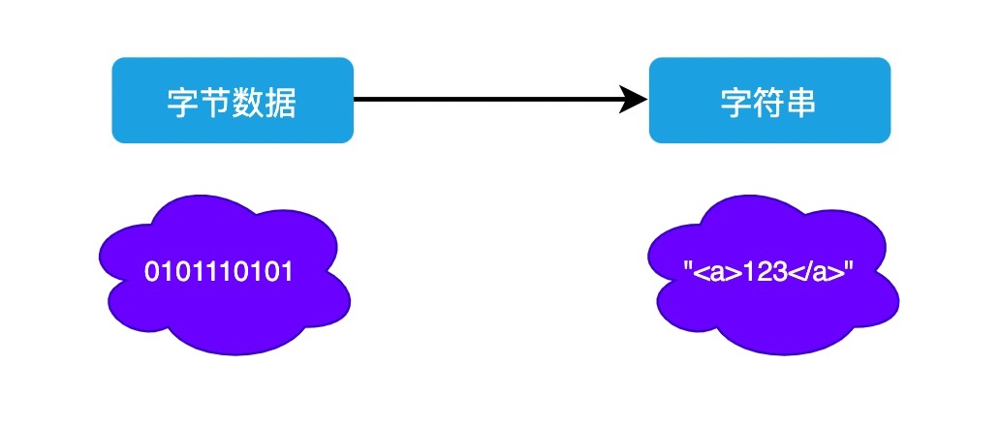
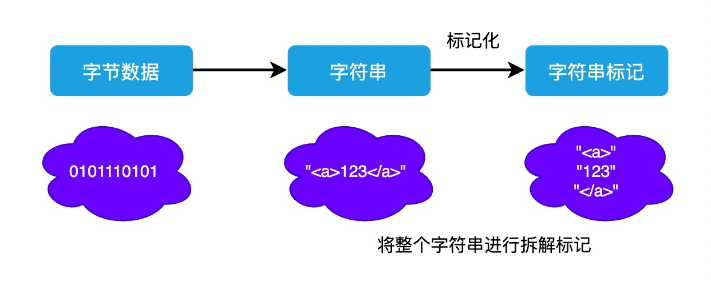
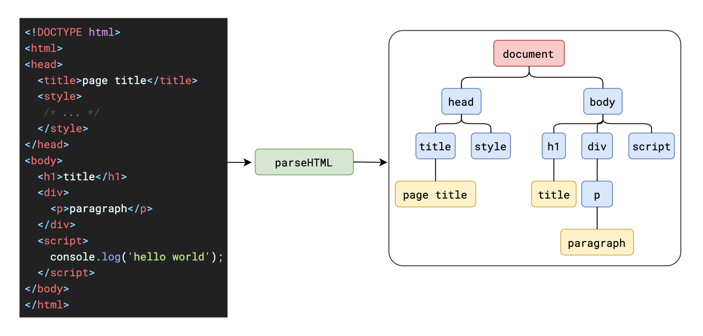
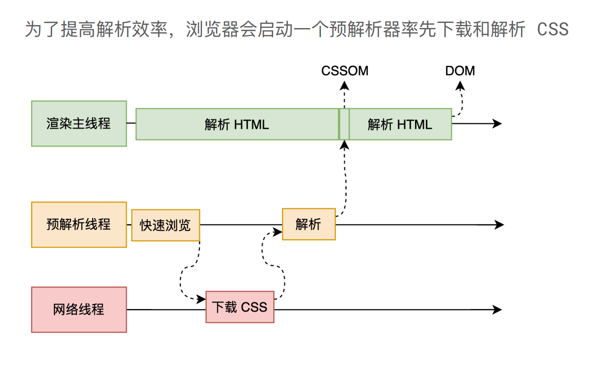
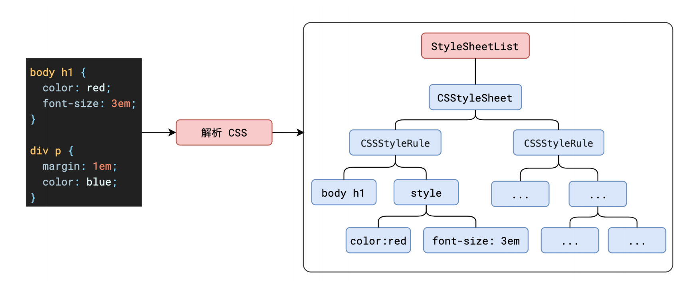

# 浏览器的渲染流程

本文主要包含以下内容：

- 浏览器渲染整体流程
- 解析 _HTML_
- 样式计算
- 布局
- 分层
- 生成绘制指令
- 分块
- 光栅化
- 绘制
- 常见面试题

## 浏览器渲染整体流程

浏览器，作为用户浏览网页最基本的一个入口，我们似乎认为在地址栏输入 _URL_ 后网页自动就出来了。殊不知在用户输入网页地址，敲下回车的那一刻，浏览器背后做了诸多的事情。

去除 _DNS_ 查找等这些细枝末节的工作，整个大的部分可以分为两个，那就是**网络**和**渲染**。


首先，浏览器的网络线程会发送 _http_ 请求，和服务器之间进行通信，之后将拿到的 _html_ 封装成一个渲染任务，并将其传递给渲染主线程的消息队列。在事件循环机制的作用下，渲染主线程取出消息队列中的渲染任务，开启渲染流程。

网络线程和服务器之间通信的过程并非本节课咱们要讨论的，本节课咱们要研究的主要内容，是浏览器的渲染进程如何将一个密密麻麻的 _html_ 字符串渲染成最终页面的。

我们先来看一下整体流程，整个渲染流程分为多个阶段，分别是： _HTML_ 解析、样式计算、布局、分层、生成绘制指令、分块、光栅化、绘制：


每个阶段都有明确的输入输出，上一个阶段的输出会成为下一个阶段的输入。

这样，整个渲染流程就形成了一套组织严密的生产流水线。

接下来，咱们就一起来看一下每一个阶段的各个流程究竟是在干什么。

## 解析 _HTML_

首先第一步就是解析 _html_，生成 _DOM_ 树。

当我们打开一个网页时，浏览器都会去请求对应的 _HTML_ 文件。虽然平时我们写代码时都会分为 _HTML、CSS、JS_ 文件，也就是字符串，但是计算机硬件是不理解这些字符串的，所以在网络中传输的内容其实都是 _0_ 和 _1_ 这些字节数据。

当浏览器接收到这些字节数据以后，它会将这些字节数据转换为字符串，也就是我们写的代码。



当数据转换为字符串以后，浏览器会先将这些字符串通过词法分析转换为标记（ _token_ ），这一过程在词法分析中叫做标记化（ _tokenization_ ）。

为什么需要标记化呢？原因很简单，现在浏览器虽然将字节数据转为了字符串，但是此时的字符串就如何一篇标题段落全部写在一行的文章一样，浏览器此时仍然是不能理解的。

例如：

```html
<!DOCTYPE html>
<html lang="en">
  <head>
    <title>Document</title>
  </head>
  <body>
    <p>this is a test</p>
  </body>
</html>
```

因此现在所做的标记化，本质就是要将这长长的字符串分拆成一块块，并给这些内容打上标记，便于理解这些最小单位的代码是什么意思。



将整个字符串进行了标记化之后，就能够在此基础上构建出对应的 _DOM_ 树出来。



上面的步骤，我们就称之为解析 _HTML_。整个流程如下图：


在解析 _HTML_ 的过程中，我们可以能会遇到诸如 _style、link_ 这些标签，聪明的你应该已经想到了，这是和我们网页样式相关的内容。此时就会涉及到 _CSS_ 的解析。

为了提高解析效率，浏览器在开始解析前，会启动一个预解析的线程，率先下载 _HTML_ 中的外部 _CSS_ 文件和外部的 _JS_ 文件。

如果主线程解析到 _link_ 位置，此时外部的 _CSS_ 文件还没有下载解析好，主线程不会等待，继续解析后续的 _HTML_。这是因为下载和解析 _CSS_ 的工作是在预解析线程中进行的。这就是 _CSS_ 不会阻塞 _HTML_ 解析的根本原因。



最终，_CSS_ 的解析在经历了从字节数据、字符串、标记化后，最终也会形成一颗 _CSSOM_ 树。



上面也有提到，预解析线程除了下载外部 _CSS_ 文件以外，还会下载外部 _JS_ 文件，那么这里同学们自然也会好奇针对 _JS_ 代码浏览器是如何处理的？

如果主线程解析到 _script_ 位置，会停止解析 _HTML_，转而等待 _JS_ 文件下载好，并将全局代码解析执行完成后，才能继续解析 _HTML_。

为什么呢？

这是因为 _JS_ 代码的执行过程可能会修改当前的 _DOM_ 树，所以 _DOM_ 树的生成必须暂停。这就是 _JS_ 会阻塞 _HTML_ 解析的根本原因。


因此，如果你想首屏渲染的越快，就越不应该在最前面就加载 _JS_ 文件，这也是都建议将 _script_ 标签放在 _body_ 标签底部的原因。

```html
<html>
  <head>
    ...
  </head>
  <body>
    <p></p>
    <script src="..."></script>
  </body>
</html>
```

另外，在现代浏览器中，为我们提供了新的方式来避免 _JS_ 代码阻塞渲染的情况：

- _async_
- _defer_
- _prefetch_
- _preload_

关于这几种方式的区别，我们在另外一篇文章中再具体来看。

最后总结一下此阶段的成果，第一步完成后，会得到 _DOM_ 树和 _CSSOM_ 树，浏览器的默认样式、内部样式、外部样式、行内样式均会包含在 _CSSOM_ 树中。

得到了两棵树，如下图所示：


## 样式计算

接下来进入第二步：样式计算

拥有了 _DOM_ 树我们还不足以知道页面的外貌，因为我们通常会为页面的元素设置一些样式。主线程会遍历得到的 _DOM_ 树，依次为树中的每个节点计算出它最终的样式，称之为 _Computed Style_。

在这一过程中，很多预设值会变成绝对值，比如 _red_ 会变成 _rgb(255,0,0)_；相对单位会变成绝对单位，比如 _em_ 会变成 _px_。


浏览器会确定每一个节点的样式到底是什么，并最终生成一颗样式规则树，这棵树上面记录了每一个 _DOM_ 节点的样式。

另外需要注意的是，这里所指的浏览器确定每一个节点的样式，是指在样式计算时会对所有的 _DOM_ 节点计算出**所有的**样式属性值。如果开发者在书写样式时，没有写某一项样式，那么大概率会使用其默认值。例如：


关于样式计算的详细过程，请参阅文章《_CSS_ 属性计算过程》。

这一步完成后，我们就得到一棵带有样式的 _DOM_ 树。也就是说，经过样式计算后，之前的 _DOM_ 数和 _CSSOM_ 数合并成了一颗带有样式的 _DOM_ 树。


## 布局

前面这些步骤完成之后，渲染进程就已经知道页面的具体文档结构以及每个节点拥有的样式信息了，可是这些信息还是不能最终确定页面的样子。

举个例子，假如你现在想通过电话告诉你的朋友你身边的一幅画的内容：“画布上有一个红色的大圆圈和一个蓝色的正方形”，单凭这些信息你的朋友是很难知道这幅画具体是什么样子的，因为他不知道大圆圈和正方形具体在页面的什么位置，是正方形在圆圈前面呢还是圆圈在正方形的前面。


渲染网页也是同样的道理，只知道网站的文档流以及每个节点的样式是远远不足以渲染出页面内容的，还需要通过布局（_layout_）来计算出每个节点的几何信息（_geometry_）。

生成布局树的具体过程是：主线程会遍历刚刚构建的 _DOM_ 树，根据 _DOM_ 节点的计算样式计算出一个布局树（_layout tree_）。布局树上每个节点会有它在页面上的 _x，y_ 坐标以及盒子大小（_bounding box sizes_）的具体信息。


布局树大部分时候，和 _DOM_ 树并非一一对应。虽然它长得和先前构建的 _DOM_ 树差不多，但是不同的是这颗树只有那些可见的（_visible_）节点信息。

比如 _display:none_ 的节点没有几何信息，因此不会生成到布局树；


又比如使用了伪元素选择器，虽然 _DOM_ 树中不存在这些伪元素节点，但它们拥有几何信息，所以会生成到布局树中。


还有匿名行盒、匿名块盒等等都会导致 _DOM_ 树和布局树无法一一对应。


## 分层

在确认了布局树后，接下来就是绘制了么？

还不急，这里还会有一个步骤，就是**分层**。


分层的好处在于，将来某一个层改变后，仅会对该层进行后续处理，从而提升效率。

为了确定哪些元素需要放置在哪一层，主线程需要遍历整颗布局树来创建一棵层次树（_Layer Tree_）


滚动条、堆叠上下文、_transform_、_opacity_ 等样式都会或多或少的影响分层结果，也可以通过使用 _will-change_ 属性来告诉浏览器对其分层。

## 生成绘制指令

分层工作结束后，接下来就是生成绘制指令。

主线程会为每个层单独产生绘制指令集，用于描述这一层的内容该如何画出来。


这里的绘制指令，类似于“将画笔移动到 _xx_ 位置，放下画笔，绘制一条 _xx_ 像素长度的线”，我们在浏览器所看到的各种复杂的页面，实际上都是这样一条指令一条指令的执行所绘制出来的。

如果你熟悉 _Canvas_，那么这样的指令类似于：

```js
context.beginPath(); // 开始路径
context.moveTo(10, 10); // 移动画笔
context.lineTo(100, 100); // 绘画出一条直线
context.closePath(); // 闭合路径
context.stroke(); // 进行勾勒
```

但是你要注意，这一步只是生成诸如上面代码的这种绘制指令集，还没有开始执行这些指令。

另外，还有一个重要的点你需要知道，生成绘制指令集后，渲染主线程的工程就暂时告一段落，接下来主线程将每个图层的绘制信息提交给合成线程，剩余工作将由合成线程完成。


## 分块

合成线程首先对每个图层进行分块，将其划分为更多的小区域。


此时，它不再是像主线程那样一个人在战斗，它会从线程池中拿取多个线程来完成分块工作。


## 光栅化

分块完成后，进入**光栅化**阶段。所谓光栅化，就是将每个块变成位图。

更简单的理解就是确认每一个像素点的 _rgb_ 信息，如下图所示：


光栅化的操作，并不由合成线程来做，而是会由合成线程将块信息交给 _GPU_ 进程，以极高的速度完成光栅化。


_GPU_ 进程会开启多个线程来完成光栅化，并且优先处理靠近视口区域的块。


## 绘制

最后一步，我们总算迎来了真正的绘制。

当所有的图块都被栅格化后，合成线程会拿到每个层、每个块的位图，从而生成一个个「指引（quad）」信息。


指引会标识出每个位图应该画到屏幕的哪个位置，以及会考虑到旋转、缩放等变形。

变形发生在合成线程，与渲染主线程无关，这就是 _transform_ 效率高的本质原因。

合成线程会通过 IPC 向浏览器进程（_browser process_）提交（_commit_）一个渲染帧。这个时候可能有另外一个合成帧被浏览器进程的 *UI*线程（_UI thread_）提交以改变浏览器的 _UI_。这些合成帧都会被发送给 _GPU_ 完成最终的屏幕成像。

如果合成线程收到页面滚动的事件，合成线程会构建另外一个合成帧发送给 _GPU_ 来更新页面。


最后总结一下浏览器从拿到 _html_ 文档到最终渲染出页面的整体流程，如下图：


## 常见面试题

1. 什么是 _reflow_？

> _reflow_ 的本质就是重新计算 _layout_ 树。
>
> 当进行了会影响布局树的操作后，需要重新计算布局树，会引发 _layout_。
>
> 为了避免连续的多次操作导致布局树反复计算，浏览器会合并这些操作，当 _JS_ 代码全部完成后再进行统一计算。所以，改动属性造成的 _reflow_ 是异步完成的。
>
> 也同样因为如此，当 _JS_ 获取布局属性时，就可能造成无法获取到最新的布局信息。
>
> 浏览器在反复权衡下，最终决定获取属性立即 _reflow_。
>
> 

2. 什么是 _repaint_？

> _repaint_ 的本质就是重新根据分层信息计算了绘制指令。
>
> 当改动了可见样式后，就需要重新计算，会引发 _repaint_。
>
> 由于元素的布局信息也属于可见样式，所以 _reflow_ 一定会引起 _repaint_。
>
> 

3. 为什么 _transform_ 的效率高？

> 因为 _transform_ 既不会影响布局也不会影响绘制指令，它影响的只是渲染流程的最后一个「_draw_」阶段
>
> 由于 _draw_ 阶段在合成线程中，所以 _transform_ 的变化几乎不会影响渲染主线程。反之，渲染主线程无论如何忙碌，也不会影响 _transform_ 的变化。
>
> 

-_EOF_-
