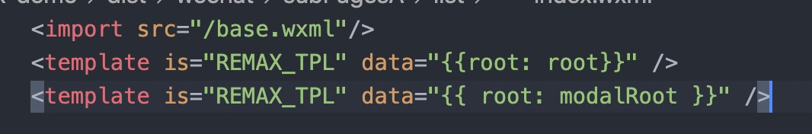
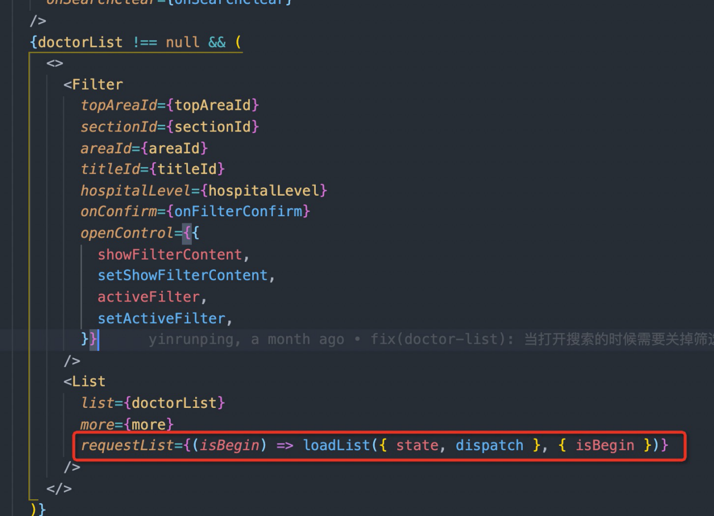
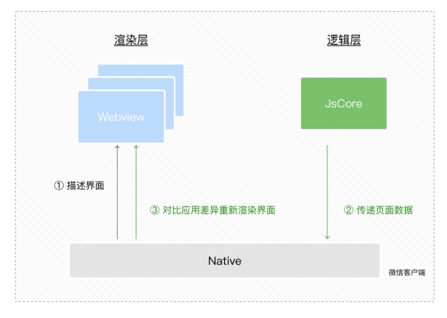
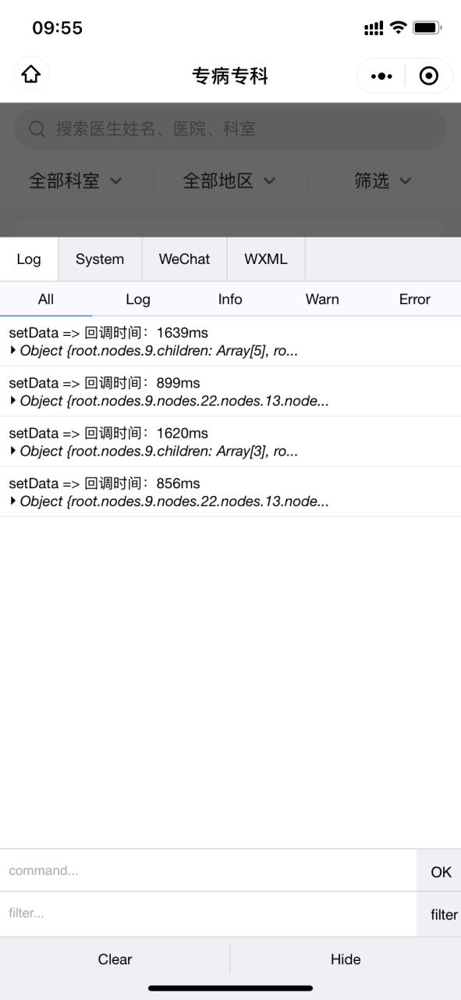
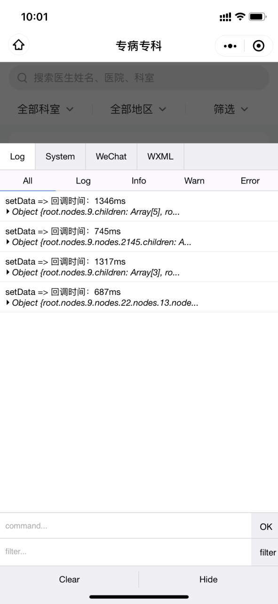
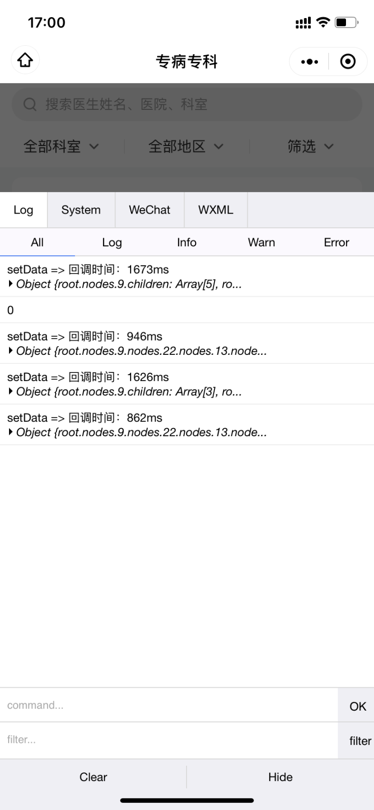
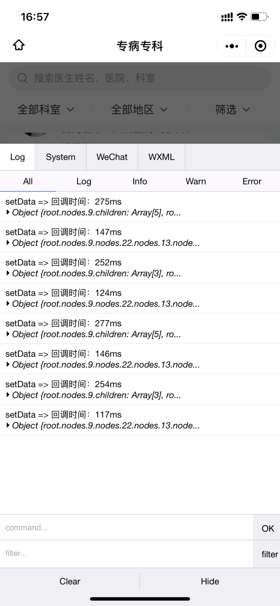
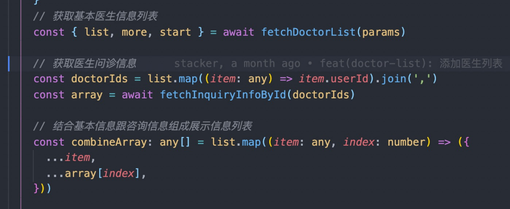
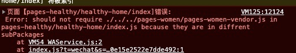
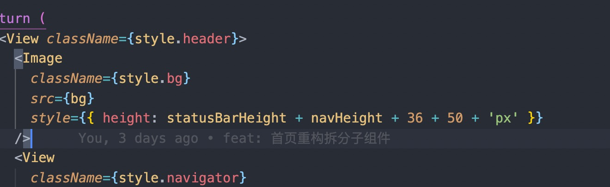

# 患者端小程序-医生列表卡顿分析

## Remax导致小程序卡？
- 对比试验
1. 小程序运行时AppData数据大小影响setData的执行时间（数据diff，setData合并）
2. 用于渲染层的renderData（<= =AppData）数据大小影响setData的回调时间，即渲染层的重新渲染时间。此时即使setData的数据量非常小，渲染层处理的时间也会比较长
3. 尝试在渲染层数据大小和setData的数据大小之间找到一个平衡
4. 虚拟节点vNode导致数据变大，层级变深


## Remax原理
remax通过react-reconciler引入vNode，每个页面的节点信息都被存入小程序的Page的data属性中，通过小程序的template模板渲染。remax封装定义了一些列的模板，通过递归遍历节点数据信息，判断元素的类型选择对应的模板渲染。
编译完后每个小程序页面的wxml的内容都一样的



### React角度
- 减少不必要的render：React.memo、useCallback
- 减少计算量：useMemo
- 合理拆分组件，最小粒度化更新

***注意匿名函数导致组件重新diff***

List组件使用React.memo之后，组件一样会重新渲染。原因是匿名函数每次都是重新创建的，判断为diff了。




## 小程序角度

### setData的工作原理

- 视图层：webview作为渲染载体
- 逻辑层：独立的JavascriptCode作为运行环境
- 数据传输：并不具备直接共享通道，通过两边提供的evaluateJavascript实现。传输的数据需要将其转为字符串形式传递，然后把转换后的数据内容拼接成一份JS脚本，再通过执行Js脚本的形式传递。数据到达视图层并不是实时的。



### 小程序常见问题

1. 频繁的去setData
2. 每次setData都传递大量新数据，数据量过大转换后的JS脚本会增加编译执行时间，占用webview JS线程
3. 后台态页面进行setData，后台态页面的渲染对用户无感，视为无效渲染，但是会抢占前台页面的执行
4. 大图片和多图片，可能导致iOS客户端内存占用上升，导致系统回收小程序页面。除了内存问题外，也可能导致页面切换的卡顿
5. WXML节点数过多，会增加内存的使用，样式重排时间也会更长

### 后台态页面

首页的banner轮播自动切换导致整个Home函数组件重新执行，即使在后台态之后
- 抽离轮播组件，保证最小粒度更新
- 后台态判断，后台之后暂停轮播

### 图片资源
使用七牛云的图片压缩裁剪服务+图片lazy-load懒加载

- 裁剪设定：

尺寸：200 * 200

方式：等比缩放居中裁剪

质量：原图75%

参数：imageView2/1/w/200/h/200/q/75

压缩后：图片平均体积减少到原来的25%左右

图片1    原图：249kb 压缩后：73.9kb  压缩比：29.6%

图片2   原图：620kb 压缩后：94.8kb  压缩比：15.2%

图片3  原图：109kb 压缩后：12.2kb  压缩比：11.2%

- 测试对比

机型：iPhone

医生数量：80

测试对象：科室筛选的展开收起

<center class='half'>
  
  
</center>


### WXML节点数
参考web端虚拟列表的思路，基于*IntersectionObserver*对象，减少WXML的无效渲染。
- 每次筛选项的展开收起，列表的scrollView都会回到顶部（原因？），导致大量的Item重绘，渲染层发生阻塞。记录Scrollview的滚动位置。
- 监测Item是否在可视区域内，如果不在则不渲染子节点（使用样式隐藏，减少setData的数据量）

测试对比

机型：iPhone

医生数量：80

测试对象：科室筛选的展开收起

<center class='half'>
  
  
</center>

第一版优化结果：80页的医生列表数据，筛选项的展开收起延迟在1500ms-1800ms，优化后250ms-400ms左右，医生数据越多效果差距越大

### 接口优化

1. 接口合并：医生列表信息，需要做接口合并，前端两个接口请求后再合并数据并不合理，前端调用接口受用户当前网络环境影响很不稳定，由后端接口内部服务间调用能保证请求耗时和稳定性



2. 合理缓存接口数据，避免无效的重复请求，如首页-我的健康旅途-月份切换

### 遗留问题

- Item需要固定高度，避免动态渲染的时候发生抖动
- 动态渲染子节点，在快速滚动页面的时候，setData的频率会比较高，会出现子节点还未渲染出来的情况（可增加一个占位骨架解决）
- 动态渲染Item，导致setData的频率和次数很多，考虑如何合并setData
- 即使List使用了React.memo优化了List组件的重新渲染，ScrollView还是会自动回到顶部？
- ScrollView监听dragend事件触发不了？

### TODO

- 目前监听的是单个Item，在快速切换时候可能导致setData的频率很高，需要考虑如何合并setData减少setData的频率，在setData的大小和频率间做平衡


## 使用WXS响应事件

场景：

有频繁用户交互的效果在小程序上表现是比较卡顿的，例如页面有 2 个元素 A 和 B，用户在 A 上做 touchmove 手势，要求 B 也跟随移动，movable-view 就是一个典型的例子。一次 touchmove 事件的响应过程为：

1. touchmove 事件从视图层（Webview）抛到逻辑层（App Service）
2. 逻辑层（App Service）处理 touchmove 事件，再通过 setData 来改变 B 的位置

一次*touchmove*的响应需要经过 2 次的逻辑层和渲染层的通信以及一次渲染，通信的耗时比较大。此外 setData 渲染也会阻塞其它脚本执行，导致了整个用户交互的动画过程会有延迟

## 自定义Tab页

没有使用原生的tab页的原因：tab页必须在主包里，可能导致主包过大。
hack解决方案：tab页是空白页，redirect到子包页（可能有闪屏的问题，待确认效果），***此方案不行 redirect之后tab不可见了***

## 主包体积优化

remax的默认splitChunk的默认配置是只要引用过两次的组件都会打包到remax-vendor.js，并未区分子包，也就是说子包里的引用超过两次的组件也会打包到remax-vendor.js里导致主包过大。

重新配置splitChunk的策略，让子包内的公用chunk打包到子包内。（此策略会加到我们新版脚手架中）

注意点：子包之间避免交叉引用，若有需要提升组件层级到外层components

大部分节点都有hover-class等默认信息，是否能去掉？

封装了hook的方法，有些地方任然使用props传递，如首页的useNavHeight ，可以在组件里直接使用
间距直接使用css实现，不要使用标签占位，尽量减少标签数

分包优化
```js
const subPackages = [
      'pages-common',
      'pages-inquiry',
      'pages-followup',
      'pages-prescription',
      'pages-healthy',
      'pages-mall',
      'pages-women',
      'pages-video',
      'pages-ncd',
    ]
    const extensions = ['.mjs', '.js', '.jsx', '.ts', '.tsx', '.json']
    const moduleMatcher = new RegExp(`(${extensions.filter((e) => e !== '.json').join('|')})$`)


    const jsVendors = (subPackages || []).reduce((result, name) => {
      result[`${name}Vendor`] = {
        name: `${name}/${name}-vendor`,
        test: (module, { chunkGraph, moduleGraph }) => {
          if (module.resource && module.resource.match(/text3\.tsx/)) {
            console.log(`${name}Vendor`, module.resource)
          }
          return (
            module.resource &&
            module.resource.match(new RegExp(`${name}/.+[.mjs|.js|.jsx|.ts|.tsx]`))
          )
        },
        chunks: 'initial',
        minChunks: 2,
        minSize: 0,
        priority: 2,
      }
      return result
    }, {})
    // console.log(jsVendors);
    config.optimization.splitChunks({
      cacheGroups: {
        remaxStyles: {
          name: 'remax-styles',
          test: new RegExp(`(.css|.less|.sass|.scss|.stylus|.styl)$`),
          chunks: 'initial',
          minChunks: 2,
          minSize: 0,
        },
        ...jsVendors,
        remaxVendors: {
          name: 'remax-vendors',
          test: (module, { chunkGraph, moduleGraph }) => {
            const isSubPackage =
              module.resource &&
              module.resource.match(
                new RegExp(`(${(subPackages || []).join('|')})/.+[.mjs|.js|.jsx|.ts|.tsx]`)
              )
            const isTarget = module.resource && module.resource.match(moduleMatcher)

            //排除子包
            return !isSubPackage && isTarget
          },
          chunks: 'initial',
          minChunks: 2,
          minSize: 0,
          priority: 2,
        },
      },
    })
```
优化后remax-vendor.js从1.1M减少为900kb
需要避免主包引用子包的组件，否则容易造成如下错误


navigateTo不统一，有的使用'remax/wechat'下的navigateTo，有的使用@/router/router下的navigateTo

usePageEvent和useAppEvent 即使是函数组件，也只能在组件被直接页面组件引入的情况，层级再深就不会触发了


jsx内联的尺寸为什么不用rpx作为单位？


View组件对应的vnode有一些默认属性，当view量过大时，这些默认属性会隐形的增加data的体积，使用text替换，大概能减少 10%的体积
https://github.com/remaxjs/remax/issues/1586

