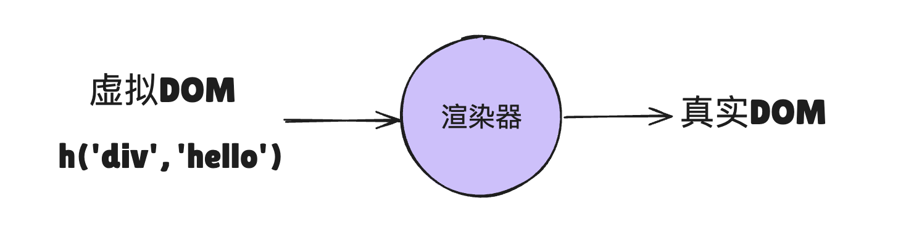

# Vue 运行机制

> 面试题：介绍一下 Vue3 内部的运行机制是怎样的？

Vue3 整体可以分为几大核心模块：

- 响应式系统
- 编译器
- 渲染器

## 如何描述 UI

思考 🤔：UI 涉及到的信息有哪些？

1. DOM 元素
2. 属性
3. 事件
4. 元素的层次结构

思考 🤔：如何在 JS 中描述这些信息？

考虑使用对象来描述上面的信息

```html
<h1 id="title" @click="handler"><span>hello</span></h1>
```

```js
const obj = {
  tag: "h1",
  props: {
    id: "title",
    onClick: handler,
  },
  children: [
    {
      tag: "span",
      children: "hello",
    },
  ],
};
```

虽然这种方式能够描述出来 UI，但是非常麻烦，因此 Vue 提供了模板的方式。

用户书写模板----> 编译器 ----> 渲染函数 ----> 渲染函数执行得到上面的 JS 对象（虚拟 DOM）

虽然大多数时候，模板比 JS 对象更加直观，但是偶尔有一些场景，JS 的方式更加灵活

```vue
<h1 v-if="level === 1"></h1>
<h2 v-else-if="level === 2"></h2>
<h3 v-else-if="level === 3"></h3>
<h4 v-else-if="level === 4"></h4>
<h5 v-else-if="level === 5"></h5>
<h6 v-else-if="level === 6"></h6>
```

```js
let level = 1;
const title = {
  tag: `h${level}`,
};
```

## 编译器

主要负责将开发者所书写的**模板转换为渲染函数**。例如：

```vue
<template>
  <div>
    <h1 :id="someId">Hello</h1>
  </div>
</template>
```

编译后的结果为：

```js
function render() {
  return h("div", [h("h1", { id: someId }, "Hello")]);
}
```

执行渲染函数，就会得到 JS 对象形式的 UI 表达。

整体来讲，整个编译过程如下图所示：


可以看到，在编译器的内部，实际上又分为了：

- 解析器：负责将模板解析为对应的模板 AST（抽象语法树）
- 转换器：负责将模板 AST 转换为 JS AST
- 生成器：将 JS AST 生成对应的 JS 代码（渲染函数）

Vue3 的编译器，除了最基本的编译以外，还做了很多的优化：

1. 静态提升
2. 预字符串化
3. 缓存事件处理函数
4. Block Tree
5. PatchFlag

## 渲染器

执行渲染函数得到的就是虚拟 DOM，也就是像这样的 JS 对象，里面包含着 UI 的描述信息

```html
<div>点击</div>
```

```js
const vnode = {
  tag: "div",
  props: {
    onClick: () => alert("hello"),
  },
  children: "点击",
};
```

渲染器拿到这个虚拟 DOM 后，就会将其转换为真实的 DOM



一个简易版渲染器的实现思路：

1. 创建元素
2. 为元素添加属性和事件
3. 处理 children

```js
function renderer(vnode, container) {
  // 1. 创建元素
  const el = document.createElement(vnode.tag);
  // 2. 遍历 props，为元素添加属性
  for (const key in vnode.props) {
    if (/^on/.test(key)) {
      // 如果 key 以 on 开头，说明它是事件
      el.addEventListener(
        key.substr(2).toLowerCase(), // 事件名称 onClick --->click
        vnode.props[key] // 事件处理函数
      );
    }
  }
  // 3. 处理children
  if (typeof vnode.children === "string") {
    el.appendChild(document.createTextNode(vnode.children));
  } else if (Array.isArray(vnode.children)) {
    // 递归的调用 renderer
    vnode.children.forEach((child) => renderer(child, el));
  }

  container.appendChild(el);
}
```

## 组件的本质

组件本质就是**一组 DOM 元素**的封装。

假设函数代表一个组件：

```js
// 这个函数就可以当作是一个组件
const MyComponent = function () {
  return {
    tag: "div",
    props: {
      onClick: () => alert("hello"),
    },
    children: "click me",
  };
};
```

vnode 的 tag 就不再局限于 html 元素，而是可以写作这个函数名：

```js
const vnode = {
  tag: MyComponent,
};
```

渲染器需要新增针对这种 tag 类型的处理：

```js
function renderer(vnode, container) {
  if (typeof vnode.tag === "string") {
    // 说明 vnode 描述的是标签元素
    mountElement(vnode, container);
  } else if (typeof vnode.tag === "function") {
    // 说明 vnode 描述的是组件
    mountComponent(vnode, container);
  }
}
```

组件也可以使用对象的形式：

```js
const MyComponent = {
  render() {
    return {
      tag: "div",
      props: {
        onClick: () => alert("hello"),
      },
      children: "click me",
    };
  },
};
```

```js
function renderer(vnode, container) {
  if (typeof vnode.tag === "string") {
    // 说明 vnode 描述的是标签元素
    mountElement(vnode, container);
  } else if (typeof vnode.tag === "object") {
    // 说明 vnode 描述的是组件
    mountComponent(vnode, container);
  }
}
```

## 响应式系统

总结：当模板编译成的渲染函数执行时，渲染函数内部用到的响应式数据会和渲染函数本身构成依赖关系，之后只要响应式数据发生变化，渲染函数就会重新执行。

### 面试题：介绍一下 vue3 的运行机制是怎么样的

> 参考答案：
>
> Vue3 是一个声明式框架啊。声明式的的好处在于，它直接描述结果，用户不需要关注过程。Vue 采用模板来描述 UI，但它同样支持使用虚拟 DOM + h 函数 来描述 UI。在某些情况下，使用虚拟 DOM 来描述 UI 会更加灵活
>
> 当开发者使用模板来描述 UI 时，Vue 的`编译器`会将模板编译为渲染函数，渲染函数执行后返回一个虚拟 DOM 树，并为响应式数据和渲染函数建立依赖关系。在更新时，响应式数据一变化，就会触发渲染函数重新执行。
>
> 渲染函数执行后得到虚拟 DOM，之后就需要`渲染器`将虚拟 DOM 渲染为真实 DOM。它的工作原理是递归的便利虚拟 DOM 树，并调用原生 DOM API 来完成后真实 DOM 的创建。渲染器的精髓在于后续更新时，通过`Diff`算法找出变化节点、变化的内容，并且只会更新需要更新的内容
>
> 编译器、渲染器、响应式系统都是 Vue 内部的核心模块，他们共同构成一个优秀的系统，能够高效的完成前端的渲染工作。
